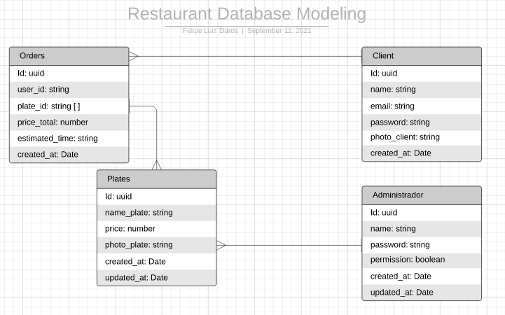

# API Restaurante

### Regras de negócio
****
**Cliente deverá informar seu nome, email e senha quando criar uma conta.**

**Não será possível dois clientes com o mesmo email.**

**Pratos devem ter um nome, preço e uma foto do prato.**

**O ADM deverá estar logado para cadastrar um prato novo**

**Ao cadastrar um novo prato deverá ser necessário informar uma foto.**

**O restaurante deve gerar uma rodem com o nome do cliente que solicitou, os pratos e o valor total do pedido com a data.**

**Ao fazer o pedido o cliente deverá informar a quantidade dos produtos.**

 
 

### Requisítos Funcionais

- Deve ser possível criar uma conta.

- Deve ser possível adicionar uma foto no perfil do cliente.

- Listagem de todos os clientes cadastrados.

- Deve ser possível cadastrar um prato com a conta de administador.

- Deve ser possível adicionar foto do prato.

- Deve ser possível listar todos os pratos

- Deve ser possível lista o prato pelo nome.

- Listagem dos pedidos de todos o pedidos.

- Deve ser posssível listar o pedidos pelo nome do cliente.

 
 

